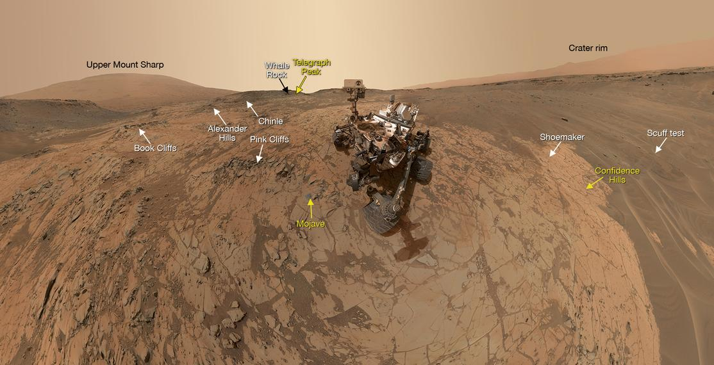

# 扉页 Flyleaf

NASA SP-2016-6105 Rev2 再版自 SP-2007-6105 Rev1  December, 2007.

**封面照片：**

*上左：*
在这张照片中，由研究工程师格雷格·加特林（Greg Gatlin）领导的工程师们在位于弗吉尼亚州汉普顿的 NASA 兰利研究中心里的一个 14×22 英尺的亚音速风洞测试中，给一个 1:18（5.8%） 比例的新一代混合翼身布局( HWB )模型机喷洒荧光油膜。这种荧光油膜可以帮助研究人员“看到”流经模型及模型周围的空气的气流型态（flow patterns）。(NASA Langley/Preston Martin)

*上右：*
NASA 兰利研究中心于 2016 年 8 月 24 日猎户座飞船（Orion）的一个测试版本进行水流冲击试验。(NASA)

 *下左：*
 放置在支撑结构上的詹姆斯·韦伯望远镜（James Webb Space Telescope,JWST）的两块测试子镜。
two test mirror segments are placed onto the support structure that will hold them. (NASA/Chris Gunn)

 *下右：*
这张 NASA 的好奇号火星探测器的自拍展示了探测车所处的莫哈韦陨击坑地区（Mojave）的风貌。探测器正是在这里对夏普山（Mount Sharp）进行了第二次钻探取样。(NASA/JPL-Caltech/MSSS)


关于本书的**评论、问题和建议**可以发送给以下联系方式：
```
Steven R. Hirshorn
Chief Engineer, Aeronautics Research Mission Directorate (ARMD)
Office of the Chief Engineer
NASA Headquarters, Room 6D37
300 E St SWWashington, DC 20546-0001
202-358-0775
steven.r.hirshorn@nasa.gov
```
译者：
Qi XM
*qixm@protonmail.com*
